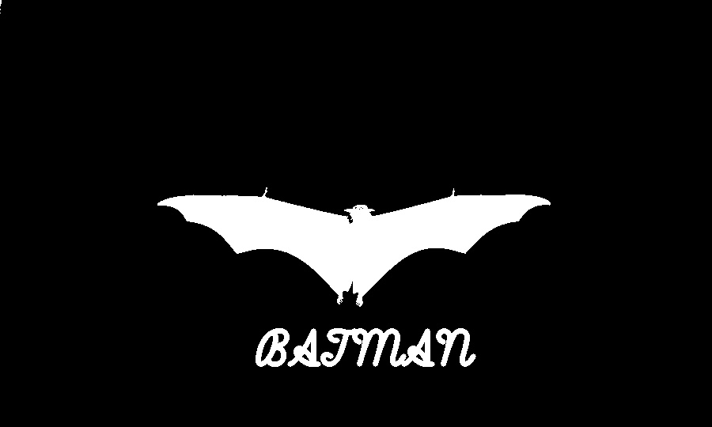

# Assignment 2

In this section, I created many projects on basic image processing with OpenCV Library and Numpy Library

## Batman Logo

- 🦇 : Created Batman Logo

## TV Noise

- 📺 : Created TV Noise (you can see output in a gif file)

## Snow Landscape

- ❄️ : Created Beautiful Snow Landscape (you can see output in a gif file)

## How to Install
Run Following Command : 
```
pip install -r requirement.txt
```
## How to Run
After Install , You can Run Following Command in Terminal to see the result :
```
python main.py
```
❗Important

you should be go to The Folder and Run that Command . Don't Forget it .

You Can Run This Command to Go the any Folder (Example : cd "Batman_Logo"):
```
cd "folder-name"
```

In End , You Can Back to the Main Folder by Run this Command :
```
cd ..
```
## Result

### Batman Logo


### Snow Landscape


### TV Noise

